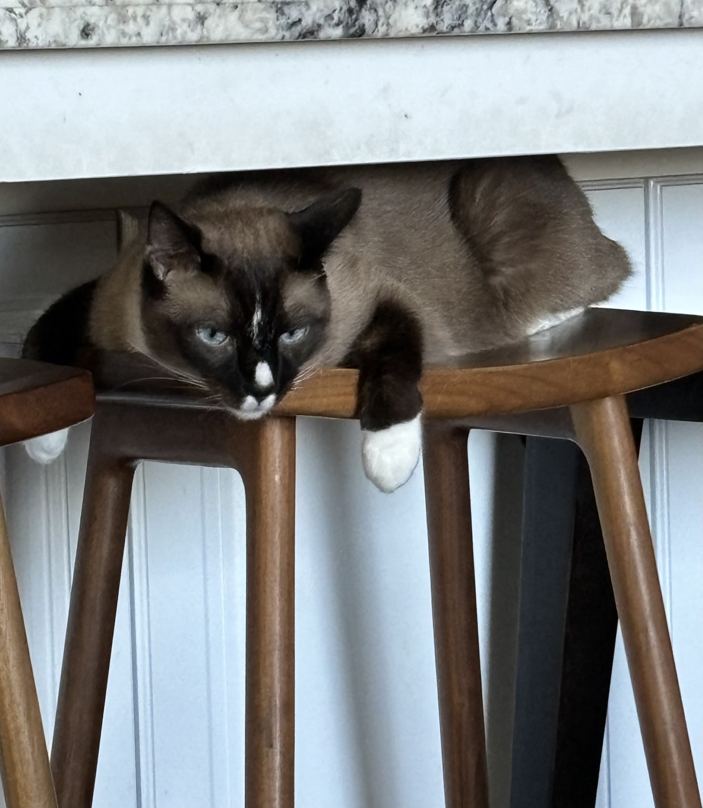
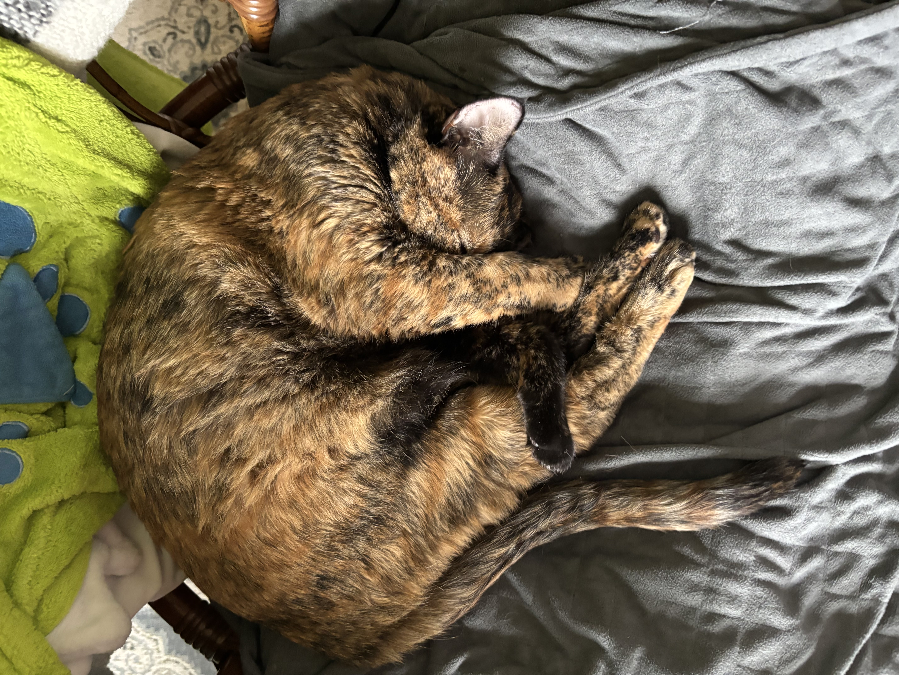
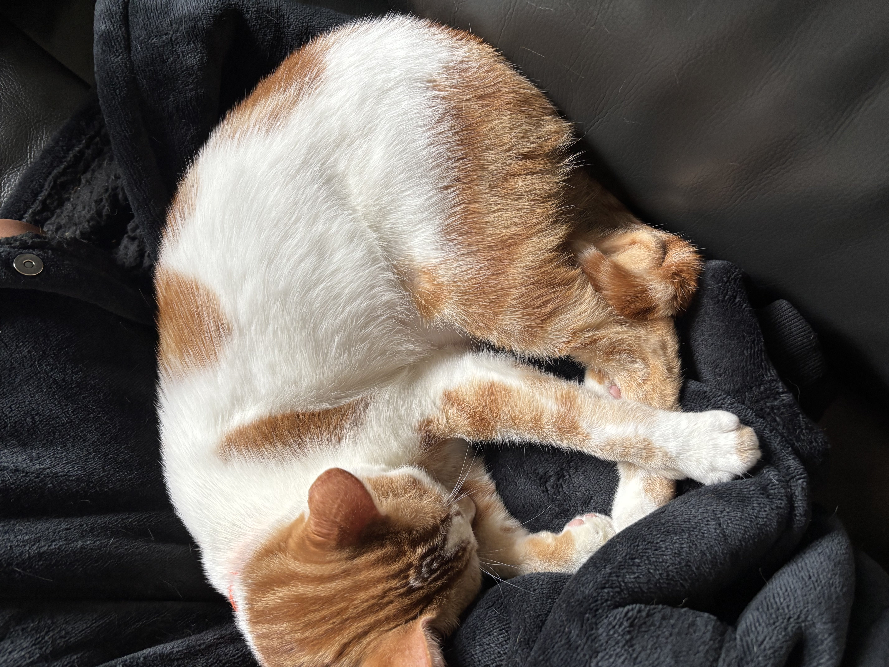

 
My Journey is somehow starting. No idea how that happened.
 

# MY CATS

They're pretty cute right?

 

## Tools
<a href="/notebooks/Foundation/B-tools_and_equipment/2023-08-22-devops_tools-verify.ipynb">
<button> Tools Verification </button>
</a>

## Code

<a href="{{site.baseurl}}/}snake.html">
<button> SNAKE </button>
</a>